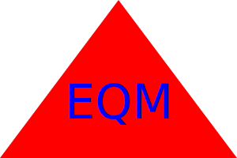

# LogoGenerator

In this challenge, I created a logo generator utilizing the jest and inquire npm packages. The generator accepts user input for the characters of the logo, their color, the shape they will put into, and the color of that shape. Circle, square, and triangle shapes are available inputs. I created a class for each shape and tests for each class. I also tested the text input for the logo.

# Video Submission link

https://drive.google.com/file/d/1KHUjFoSNaDlxVKW5GUeUpS2h5LzvgU0D/view

# Example Logo File

# Github Repo

https://github.com/eqmccullough/LogoGenerator
